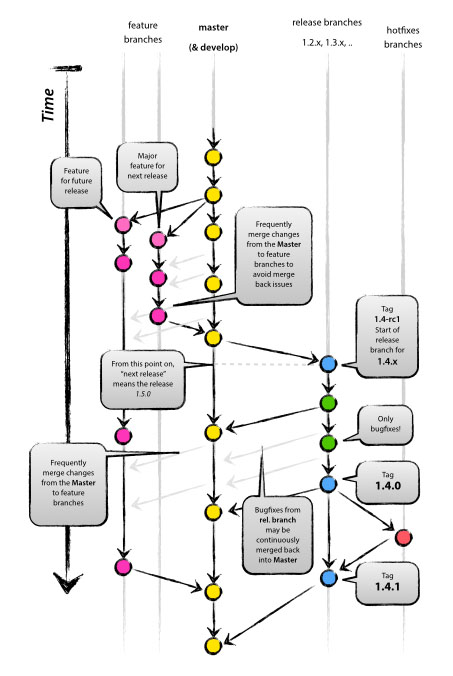

# Contributing to Galicaster

First of all, thanks for contributing to the Galicaster project!

Below are some guidelines that will help you to contribute to this project.

## Questions and support

If you have a problem with Galicaster, want to discuss a new feature or have any doubts regarding this project, consider subscribing to the galicaster community mailing list (community@galicaster.org) through this [SUBSCRIBE LINK](http://groups.google.com/a/galicaster.org/group/community/subscribe).

Feel free to send any questions you may have regarding Galicaster there.

## Report issues
                
Please give as much detail as possible:

1. Specify the tag or release branch where you found the issue.
2. Specify the steps to reproduce the issue, if possible.
3. If it is a recording issue, include the profile and/or conf.ini file with the tracks configuration. Include the hardware you are using as well.
4. Feel free to add any other details you think may be relevant.

## Contribute code

### Guidelines
* All new features must be contributed to master.
* All bugfixes should be contributed to the first affected release branch.
* Features or bug fixes that don't merge cleanly won't be accepted. You should solve any conflicts by rebasing your code with the origin branch to avoid extra *merge commits*.
* Please create a separate Pull Request for each feature/bugfix you want to contribute.
* Please use descriptive commit messages and include a reference to the relevant issue, if any (e.g. "issue #15, ").
* If you are submitting a bugfix, it's encouraged to **add a test** reproducing the bug. Make sure that the test fails if the fix is not applied.
* Try to follow PEP8. The line-length limit can be ignored if following it makes the code less readable.

### Branching model
We are using a model inspired by Vincent Driessen's [git-flow](http://nvie.com/posts/a-successful-git-branching-model/). The main difference between our model and his is that we don't have a branch named **develop**. We use the **master** branch instead to hold the latest version of the code.

For a better explanation, here is a picture of our model:

